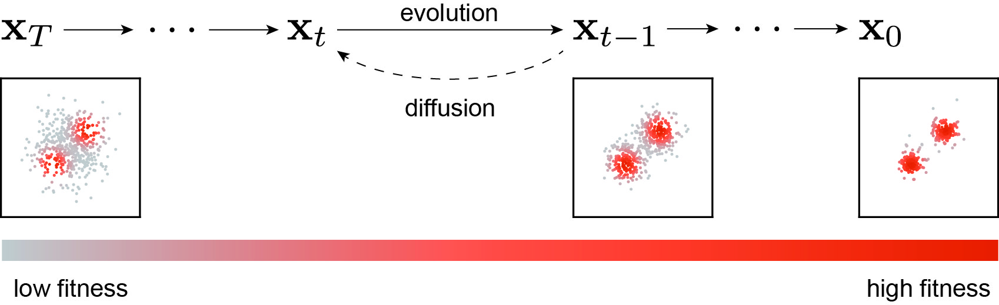
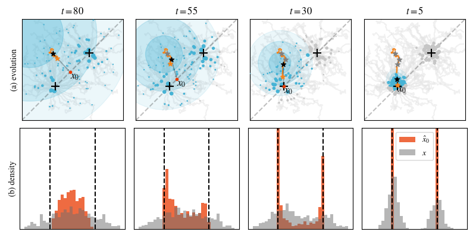

# Diffusion Evolution

This repo is for our preprint [Diffusion models are evolutionary algorithms](https://arxiv.org/abs/2410.02543), which anayatically proves that diffusion models are a type of evolutionary algorithm. This equivalence allows us to leverage advancements in diffusion models for evolutionary algorithm tasks, including accelerated sampling and latent space diffusion.



The Diffusion Evolution framework treats inversed diffusion as evolutionary algorithm, where the population estimates its added noise (or their noise-free states) based on its neighbors' fitness then evolves via denoising. The following figure shows the process on optimizing a two-peak density function. The Diffusion Evolution initially has large neighbor range (shown as blue disk), calculating $x_0$ based on the fitness of its neighbors then move toward estimated $x_0$.




## Install

You can install the package via pip:

```bash
pip install diffevo
```

or manually install:
```bash
clone https://github.com/Zhangyanbo/diffusion-evolution
cd diffevo/
pip install .
```

Some benchmark codes requires dependencies, can be installed via:
```bash
pip install cma
```

The benchmark fitness functions can be found here: https://github.com/bhartl/foobench 

## Typical Usage

In most cases, tuning hyperparameters or adding custom operations is necessary to achieve higher performance. We recommend using the following form for the best balance between conciseness and versatility.

```python
from diffevo import DDIMScheduler, BayesianGenerator
from diffevo.examples import two_peak_density

scheduler = DDIMScheduler(num_step=100)

x = torch.randn(512, 2)

for t, alpha in scheduler:
    fitness = two_peak_density(x, std=0.25)
    generator = BayesianGenerator(x, fitness, alpha)
    x = generator(noise=0)
```

The following are two evolution trajectories of different fitness functions.

## Advanced Usage

We also offer multiple choices for each component to accommodate more advanced use cases:

* In addition to the `DDIMScheduler`, we provide the `DDIMSchedulerCosine`, which features a different $\alpha$ scheduler.
* We offer multiple fitness mapping functions that map the original fitness to a different value. These can be found in `diffevo.fitnessmapping`.
* Currently, we have only one version of the generator.

Below is an example of how to change the diffusion process and conduct advanced experiments:

```python
import torch
from diffevo import DDIMScheduler, BayesianGenerator, DDIMSchedulerCosine
from diffevo.examples import two_peak_density
from diffevo.fitnessmapping import Power, Energy, Identity

scheduler = DDIMSchedulerCosine(num_step=100) # use a different scheduler

x = torch.randn(512, 2)

trace = [] # store the trace of the population

mapping_fn = Power(3) # setup the power mapping function

for t, alpha in scheduler:
    fitness = two_peak_density(x, std=0.25)
    # apply the power mapping function
    generator = BayesianGenerator(x, mapping_fn(fitness), alpha)
    x = generator(noise=0.1)
    trace.append(x)

trace = torch.stack(trace)
```


### Cite our work

```
@misc{zhang2024diffusionmodelsevolutionaryalgorithms,
      title={Diffusion Models are Evolutionary Algorithms}, 
      author={Yanbo Zhang and Benedikt Hartl and Hananel Hazan and Michael Levin},
      year={2024},
      eprint={2410.02543},
      archivePrefix={arXiv},
      primaryClass={cs.NE},
      url={https://arxiv.org/abs/2410.02543}, 
}
```
