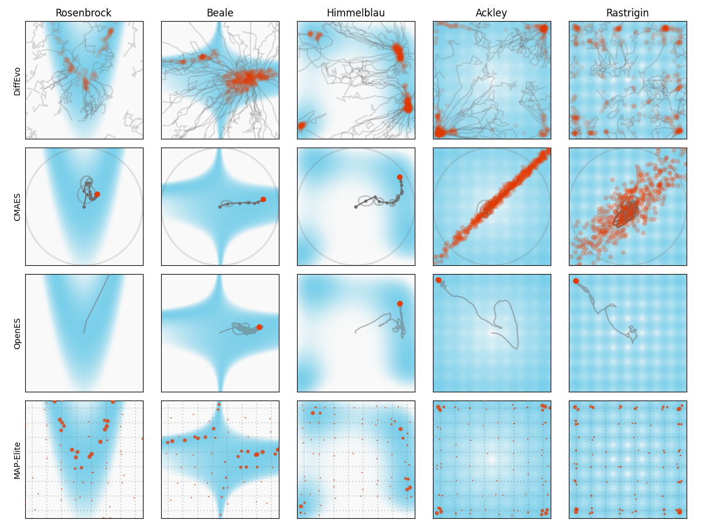

# Benchmark Experiments on 2D Fitness

To run the experiment:

```bash
python plotbenchmark.py
```

The plots are saved in `./images`. And running data are saved in `./data/{obj.foo_name}.pt`. They can be loaded by `torch.load`. An example format is:

```json
{
    "name": "himmelblau",
    "arguments": 
        {
            "limit_val": 100,
            "num_pop": 256,
            "num_step": 100,
            "scaling": 4.0,
        },
    "trace": "[[p_1, p_2, ..., p_n], [<generation 2>], ...]",
    "fitnesses": "[f_1, f_2, ..., f_n]"
}
```

To run the statistics (100 experiments for each algorithm):

```bash
python statistics.py
```

## Results

This algorithm finds all optimial points in the benchmarks. In the following figures, the white region represents high fitness, while blue means low fitness. The gray lines are the trajectories of a populations. For simplicity, here we only plot the trajectories of 64 populations.



## Ideas

- Using different probability mapping to get better results