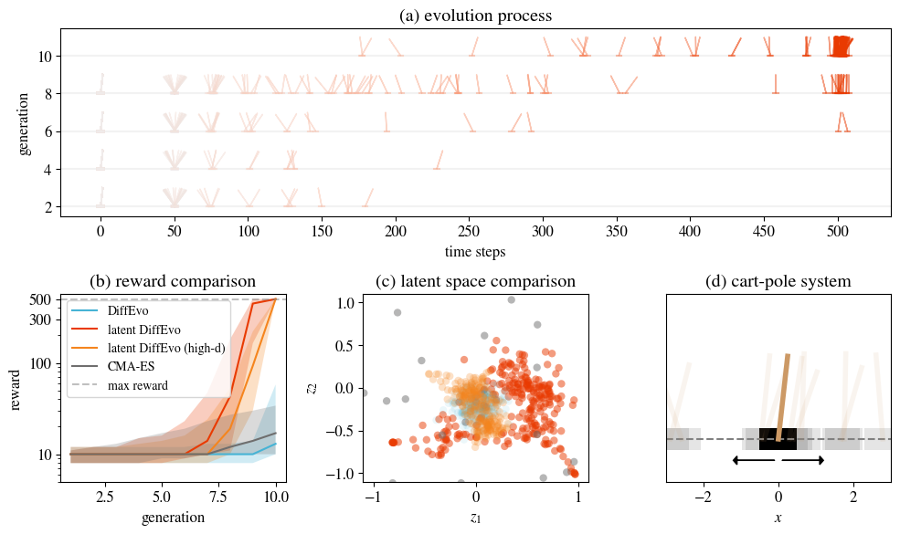

# Experiments on Cart Pole

Cart Pole is a classic control problem in reinforcement learning. The goal is to balance a pole on a cart by applying forces to the cart. The reward is 1 for each time step that the pole remains upright, maximized over 500 time steps.

These experiments aim to demonstrate the applicability of our method to high-dimensional systems using latent diffusion evolution. We also compare our approach with CMA-ES, which faces challenges in solving this problem effectively.

### Codes

| File Name | Description |
|-----------|-------------|
| `cartpole_latent.py` | The main file for latent diffusion evolution on cart pole |
| `cartpole_raw.py` | The main file for diffusion evolution on cart pole, without latent diffusion |
| `cartpole_large.py` | The main file for high-d latent diffusion evolution on cart pole |
| `cartpole_cmaes.py` | The main file for CMA-ES on cart pole |
| `visualization.py` | The main file for visualization |
| `all_experiments.py` | The main file for running all experiments |

Besides these experiments, `models.py` contains a neural network model for controlling cart pole.

### Files

- `data/`: the directory for storing the data.
    - `raw/`: the directory for storing the data of raw diffusion evolution.
    - `latent/`: the directory for storing the data of latent diffusion evolution.
    - `large/`: the directory for storing the data of high-d latent diffusion evolution.
    - `cmaes/`: the directory for storing the data of CMA-ES.
- `figures/`: the directory for storing the figures.

## Run experiments

If you want to run all experiments, you can use the following command:

```bash
python all_experiments.py
```

For each experiment, you can also run the following command:

```bash
python cartpole_raw.py
python cartpole_latent.py
python cartpole_large.py
python cartpole_cmaes.py
```

Then you can run the following command to visualize the results:

```bash
python visualization.py
```

## Results



Figure: (a) Latent diffusion evolution process of cart-pole tasks. The horizontal axis represents the longest survival time, while the vertical axis indicates the generation. Each point corresponds to an individual, with the pole angle and cart shift representing their state at their last survival time. As the evolution progresses, more cart-pole systems survive longer and achieve higher rewards. (b) Compared to the original diffusion evolution algorithm (blue), the latent diffusion evolution method (red) significantly improves performance, while the CMA-ES method (gray) fails to find any solutions. Notably, this latent method can even be applied to high-dimensional spaces (orange), with dimensions as high as 17,410. (c) By projecting the parameters of individuals into a latent space, we can visualize their diversity. For comparability, we used the same projection for all evolution results (except for the high-dimensional experiment, which has a different original dimension). This demonstrates that the latent method also enhances the diversity of the results. (d) The cart-pole system has a pole hinged to the cart. And the controller is trying to balance the pole by moving the cart left or right.